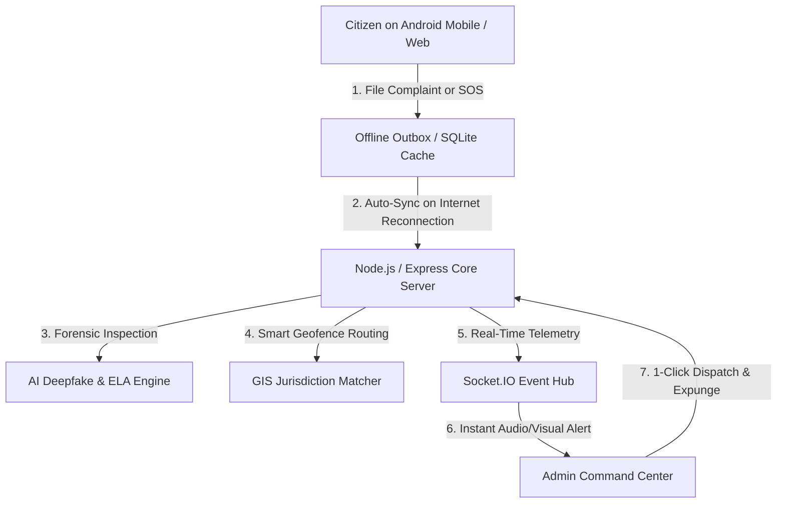

# 🚨 CIVIC-SOS
### Next-Gen AI-Powered Civic Grievance, Emergency SOS & Deepfake Forensic Platform

<p align="center">
  
  
  
  
  
  
  
  
</p>

---

## ⚡ The Story: 100% Vibe Coded with Antigravity

> **"From concept to full-stack, offline-first, native Android deployment with real-time AI computer vision forensics — built entirely through vibe coding."**

**CIVIC-SOS** was crafted from the ground up using **Vibe Coding** principles in pair programming with **Google DeepMind's Antigravity (AGY)** advanced agentic AI assistant.

Through continuous conversational iteration, Antigravity autonomously architected:
- 🏎️ **Full-Stack Monorepo Architecture**: Clean separation across REST APIs, WebSockets, GIS geometry mapping, and dual React SPAs.
- 🔬 **Custom Forensic Algorithms**: Differentiating in-app WebRTC canvas feeds from generative AI synthetic diffusions using JPEG DCT Error Level Analysis (ELA).
- 📱 **Native Mobile Compilation**: Turnkey Capacitor build pipelines producing functional Android APKs with offline outbox queues and zero-latency background auto-sync.
- 🌐 **Zero-Trust Cloud Tunnels**: Integrated Cloudflare tunnels for instant global access without port forwarding.

---

## 🌟 Key Platform Capabilities



### 1. 🚨 One-Tap Priority SOS Panic System
- **Real-Time GPS Trajectory Streaming**: Emits live breadcrumbs every 3 seconds to the command center.
- **Cruiser Geofencing & Dispatch**: Automatically locates and alerts the nearest active police unit within a 5 km radius.
- **Hardware Telemetry**: Monitors live device battery levels and network connection states.
- **Audio-Visual Siren Alarms**: Web Audio API-synthesized emergency sirens on the dispatcher console.

### 2. 🔬 AI Forensic Lab & Deepfake Detection Engine
- **Error Level Analysis (ELA)**: Recompresses images at fixed 95% quality and evaluates pixel-level DCT variance heatmaps to detect spliced seams.
- **Hardware Sensor Provenance Lock**: Validates WebRTC camera shutter provenance against physical lens optical profiles (`isDirectCamera: true` achieves ~98.6% authenticity).
- **Generative AI Prompt Scraper**: Flags synthetic image headers (Midjourney, DALL-E, Stable Diffusion, Photoshop Generative Fill).
- **SHA-256 Legal Chain of Custody**: Cryptographically seals evidence at the millisecond of capture.

### 3. 📱 Offline-First Mobile Experience (Android Native)
- **Local Outbox Queue**: Preserves incident reports, GPS coordinates, and Base64 photographic evidence when offline.
- **Background Auto-Sync Engine**: Actively listens for network re-establishment to flush queued reports automatically.
- **Offline History Caching**: Citizens can view previously registered cases even without internet access.

### 4. 🛡️ Departmental Multi-Jurisdiction Command Center
- **Interactive GIS Radar**: Visualizes municipal geofence boundaries (Police, Municipal, Water Works, Power Grid).
- **Incident Lifecycle Management**: `SUBMITTED` ➔ `VERIFIED` ➔ `ASSIGNED` ➔ `IN_PROGRESS` ➔ `RESOLVED`.
- **Permanent Case Expunge**: 1-Click database deletion that cleans up records, audit logs, and on-disk evidence files.

---

## 🛠️ Technology Stack

| Layer | Technologies Used |
| :--- | :--- |
| **Frontend Portals** | React 19, TypeScript, Tailwind CSS v4, Lucide Icons, Vite |
| **Mobile Runtime** | Capacitor Native Android SDK, Java/Kotlin Gradle Toolchain |
| **Backend Core** | Node.js (v24), Express 5, TypeScript (`tsx`) |
| **Real-Time Engine** | Socket.IO WebSockets |
| **Database** | SQLite3 (`better-sqlite3`) with Write-Ahead Logging (`WAL`) |
| **Image Forensics** | Sharp Image Processing, DCT ELA Analyzer, SHA-256 Crypto |
| **Mapping & GIS** | Leaflet, OpenStreetMap, Ray-Casting Polygon Geofencing |
| **Tunneling & Edge** | Cloudflare Zero-Trust Quick Tunnels (`cloudflared`) |

---

## 🚀 Quick Start Guide

### Prerequisites
- [Node.js](https://nodejs.org) (v18 or higher)
- [Git](https://git-scm.com/)

### ⚡ 1-Click Launch (Windows)
Double-click **`start_project.bat`** in the root directory!

This will:
1. Automatically free up any occupied ports (5000, 3000, 3001).
2. Launch the **Core Server**, **Citizen Portal**, and **Admin Command Center**.
3. Launch the **Cloudflare Public Tunnel** for external mobile and web access.

---

### 💻 Manual Startup

```bash
# 1. Clone the repository
git clone https://github.com/your-username/CIVIC-SOS.git
cd CIVIC-SOS

# 2. Install dependencies
npm install
npm run install:all

# 3. Start all services concurrently
npm run dev
```

### 🌐 Access Points
| Portal | Local URL | Production Unified URL |
| :--- | :--- | :--- |
| 👥 **Citizen Portal** | `http://localhost:3000` | `http://localhost:5000/` |
| 🛡️ **Admin Command Center** | `http://localhost:3001/admin/` | `http://localhost:5000/admin` |
| 🚀 **Backend REST API** | `http://localhost:5000/api/health` | `http://localhost:5000/api/health` |

---

## 📱 Building the Native Android APK

```bash
# 1. Build web assets
npm run build:citizen

# 2. Sync to Capacitor Android Project
cd citizen-portal
npx cap sync android

# 3. Assemble Debug APK
cd android
./gradlew assembleDebug

# Output APK located at:
# citizen-portal/android/app/build/outputs/apk/debug/app-debug.apk
```

---

## 🔒 Security & Privacy
- **Encrypted Local Storage**: Citizen credentials and auth states stored locally.
- **Immutable Audit Trail**: Every status transition and evidence upload is recorded with an cryptographic timestamp and actor ID.
- **Zero Data Leakage**: In-app camera captures bypass unverified gallery stores to guarantee evidence integrity.

---

## 👥 Authors & Acknowledgments

- **Lead Developer**: Dhaval Patel
- **AI Pair Programmer**: **Google DeepMind Antigravity (AGY)**
- **Methodology**: 100% Vibe Coded with iterative agentic execution.

---

<p align="center">
  Made with ❤️, Antigravity & Vibe Coding.
</p>
